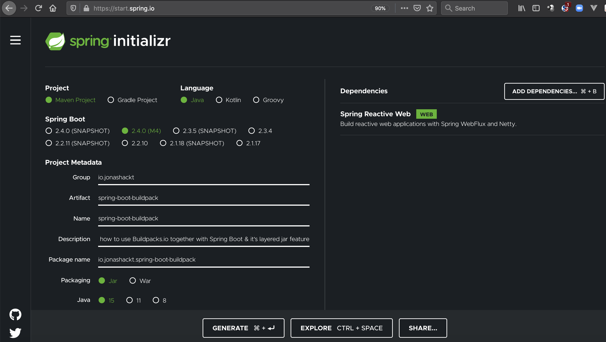
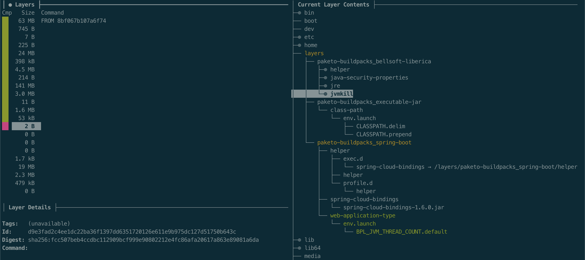
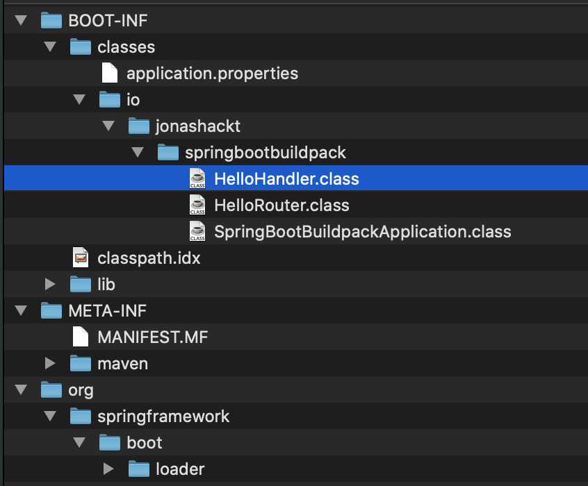
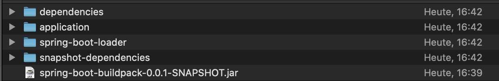
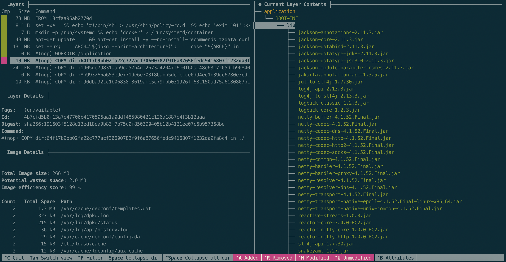

# spring-boot-buildpack

[](https://travis-ci.com/jonashackt/spring-boot-buildpack)
[](https://github.com/jonashackt/spring-boot-buildpack/blob/master/LICENSE)
[](https://renovatebot.com)
[](https://github.com/spring-projects/spring-boot)
[](https://hub.docker.com/r/jonashackt/spring-boot-buildpack)

Example project showing how to use Buildpacks.io together with Spring Boot &amp; it's layered jar feature

[](https://asciinema.org/a/368329)

I was really inspired to get to know the concept of buildpacks after attending this year's Spring One 2020 - and especially the talk by https://twitter.com/nebhale : https://www.youtube.com/watch?v=44n_MtsggnI

### Buildpacks?

* Heroku invented (2011)

> Buildpacks were first conceived by Heroku in 2011. Since then, they have been adopted by Cloud Foundry (Pivotal) and other PaaS such as Google App Engine, Gitlab, Knative, Deis, Dokku, and Drie.


### Cloud Native Buildpacks & Paketo

* today: CNCF Sandbox project 

> Specification for turning applications into Docker images: [buildpacks.io](https://buildpacks.io/)

Paketo.io is an implementation for major languages (Java, Go, .Net, node.js, Ruby, PHP...)
--> [paketo.io](https://paketo.io/)


### Maven/Gradle Plugin to use Paketo Buildpacks

The build-image plugin takes care of doing the Paketo build. From Spring Boot 2.3.x on simply run it with:

```shell script
mvn spring-boot:build-image
```


### Step by step...

Always start at [start.spring.io](start.spring.io) :)



Implement your App (e.g. building a reactive Web app using Spring Webflux).

Then run the build with:

```shell script
mvn spring-boot:build-image
```

This will do a "normal" Maven build of your Spring Boot app, but also be 

```shell script
$ mvn spring-boot:build-image
...
[INFO] --- spring-boot-maven-plugin:2.4.0-M4:build-image (default-cli) @ spring-boot-buildpack ---
[INFO] Building image 'docker.io/library/spring-boot-buildpack:0.0.1-SNAPSHOT'
[INFO]
[INFO]  > Pulling builder image 'docker.io/paketobuildpacks/builder:base' 100%
[INFO]  > Pulled builder image 'paketobuildpacks/builder@sha256:00a9c25f8f994c1a044fa772f7e9314fe5d90d329b40f51426e1dafadbfa5ac8'
[INFO]  > Pulling run image 'docker.io/paketobuildpacks/run:base-cnb' 100%
[INFO]  > Pulled run image 'paketobuildpacks/run@sha256:21c1fb65033ae5a765a1fb44bfefdea37024ceac86ac6098202b891d27b8671f'
[INFO]  > Executing lifecycle version v0.9.2
[INFO]  > Using build cache volume 'pack-cache-604f3372716a.build'
[INFO]
[INFO]  > Running creator
[INFO]     [creator]     ===> DETECTING
[INFO]     [creator]     5 of 17 buildpacks participating
[INFO]     [creator]     paketo-buildpacks/bellsoft-liberica 4.0.0
[INFO]     [creator]     paketo-buildpacks/executable-jar    3.1.1
[INFO]     [creator]     paketo-buildpacks/apache-tomcat     2.3.0
[INFO]     [creator]     paketo-buildpacks/dist-zip          2.2.0
[INFO]     [creator]     paketo-buildpacks/spring-boot       3.2.1
[INFO]     [creator]     ===> ANALYZING
[INFO]     [creator]     Restoring metadata for "paketo-buildpacks/bellsoft-liberica:jre" from app image
[INFO]     [creator]     Restoring metadata for "paketo-buildpacks/bellsoft-liberica:jvmkill" from app image
[INFO]     [creator]     Restoring metadata for "paketo-buildpacks/bellsoft-liberica:helper" from app image
[INFO]     [creator]     Restoring metadata for "paketo-buildpacks/bellsoft-liberica:java-security-properties" from app image
[INFO]     [creator]     Restoring metadata for "paketo-buildpacks/executable-jar:class-path" from app image
[INFO]     [creator]     Restoring metadata for "paketo-buildpacks/spring-boot:spring-cloud-bindings" from app image
[INFO]     [creator]     Restoring metadata for "paketo-buildpacks/spring-boot:web-application-type" from app image
[INFO]     [creator]     Restoring metadata for "paketo-buildpacks/spring-boot:helper" from app image
[INFO]     [creator]     ===> RESTORING
[INFO]     [creator]     ===> BUILDING
[INFO]     [creator]
[INFO]     [creator]     Paketo BellSoft Liberica Buildpack 4.0.0
[INFO]     [creator]       https://github.com/paketo-buildpacks/bellsoft-liberica
[INFO]     [creator]       Build Configuration:
[INFO]     [creator]         $BP_JVM_VERSION              11.*            the Java version
[INFO]     [creator]       Launch Configuration:
[INFO]     [creator]         $BPL_JVM_HEAD_ROOM           0               the headroom in memory calculation
[INFO]     [creator]         $BPL_JVM_LOADED_CLASS_COUNT  35% of classes  the number of loaded classes in memory calculation
[INFO]     [creator]         $BPL_JVM_THREAD_COUNT        250             the number of threads in memory calculation
[INFO]     [creator]         $JAVA_TOOL_OPTIONS                           the JVM launch flags
[INFO]     [creator]       BellSoft Liberica JRE 11.0.8: Reusing cached layer
[INFO]     [creator]       Launch Helper: Reusing cached layer
[INFO]     [creator]       JVMKill Agent 1.16.0: Reusing cached layer
[INFO]     [creator]       Java Security Properties: Reusing cached layer
[INFO]     [creator]
[INFO]     [creator]     Paketo Executable JAR Buildpack 3.1.1
[INFO]     [creator]       https://github.com/paketo-buildpacks/executable-jar
[INFO]     [creator]       Process types:
[INFO]     [creator]         executable-jar: java org.springframework.boot.loader.JarLauncher
[INFO]     [creator]         task:           java org.springframework.boot.loader.JarLauncher
[INFO]     [creator]         web:            java org.springframework.boot.loader.JarLauncher
[INFO]     [creator]
[INFO]     [creator]     Paketo Spring Boot Buildpack 3.2.1
[INFO]     [creator]       https://github.com/paketo-buildpacks/spring-boot
[INFO]     [creator]       Creating slices from layers index
[INFO]     [creator]         dependencies
[INFO]     [creator]         spring-boot-loader
[INFO]     [creator]         snapshot-dependencies
[INFO]     [creator]         application
[INFO]     [creator]       Launch Helper: Reusing cached layer
[INFO]     [creator]       Web Application Type: Reusing cached layer
[INFO]     [creator]       Spring Cloud Bindings 1.6.0: Reusing cached layer
[INFO]     [creator]       4 application slices
[INFO]     [creator]       Image labels:
[INFO]     [creator]         org.opencontainers.image.title
[INFO]     [creator]         org.opencontainers.image.version
[INFO]     [creator]         org.springframework.boot.spring-configuration-metadata.json
[INFO]     [creator]         org.springframework.boot.version
[INFO]     [creator]     ===> EXPORTING
[INFO]     [creator]     Reusing layer 'paketo-buildpacks/bellsoft-liberica:helper'
[INFO]     [creator]     Reusing layer 'paketo-buildpacks/bellsoft-liberica:java-security-properties'
[INFO]     [creator]     Reusing layer 'paketo-buildpacks/bellsoft-liberica:jre'
[INFO]     [creator]     Reusing layer 'paketo-buildpacks/bellsoft-liberica:jvmkill'
[INFO]     [creator]     Reusing layer 'paketo-buildpacks/executable-jar:class-path'
[INFO]     [creator]     Reusing layer 'paketo-buildpacks/spring-boot:helper'
[INFO]     [creator]     Reusing layer 'paketo-buildpacks/spring-boot:spring-cloud-bindings'
[INFO]     [creator]     Reusing layer 'paketo-buildpacks/spring-boot:web-application-type'
[INFO]     [creator]     Reusing 5/5 app layer(s)
[INFO]     [creator]     Reusing layer 'launcher'
[INFO]     [creator]     Reusing layer 'config'
[INFO]     [creator]     Adding label 'io.buildpacks.lifecycle.metadata'
[INFO]     [creator]     Adding label 'io.buildpacks.build.metadata'
[INFO]     [creator]     Adding label 'io.buildpacks.project.metadata'
[INFO]     [creator]     Adding label 'org.opencontainers.image.title'
[INFO]     [creator]     Adding label 'org.opencontainers.image.version'
[INFO]     [creator]     Adding label 'org.springframework.boot.spring-configuration-metadata.json'
[INFO]     [creator]     Adding label 'org.springframework.boot.version'
[INFO]     [creator]     *** Images (408f3d59f38e):
[INFO]     [creator]           docker.io/library/spring-boot-buildpack:0.0.1-SNAPSHOT
[INFO]
[INFO] Successfully built image 'docker.io/library/spring-boot-buildpack:0.0.1-SNAPSHOT'
[INFO]
[INFO] ------------------------------------------------------------------------
[INFO] BUILD SUCCESS
[INFO] ------------------------------------------------------------------------
[INFO] Total time:  20.009 s
[INFO] Finished at: 2020-10-27T14:29:46+01:00
[INFO] ------------------------------------------------------------------------
``` 

As you can see in the first phases `DETECTING` and `ANALYZING`, the build process analyses the given application and identifies multiple build packs that are needed to successfully package the application into a Docker image:

```
[INFO]     [creator]     ===> ANALYZING
[INFO]     [creator]     Restoring metadata for "paketo-buildpacks/bellsoft-liberica:jre" from app image
[INFO]     [creator]     Restoring metadata for "paketo-buildpacks/bellsoft-liberica:jvmkill" from app image
[INFO]     [creator]     Restoring metadata for "paketo-buildpacks/bellsoft-liberica:helper" from app image
[INFO]     [creator]     Restoring metadata for "paketo-buildpacks/bellsoft-liberica:java-security-properties" from app image
[INFO]     [creator]     Restoring metadata for "paketo-buildpacks/executable-jar:class-path" from app image
[INFO]     [creator]     Restoring metadata for "paketo-buildpacks/spring-boot:spring-cloud-bindings" from app image
[INFO]     [creator]     Restoring metadata for "paketo-buildpacks/spring-boot:web-application-type" from app image
[INFO]     [creator]     Restoring metadata for "paketo-buildpacks/spring-boot:helper" from app image
```

For example there's `paketo-buildpacks/bellsoft-liberica:jre` to bring in a JRE, since we have a Java app here. And there's also `paketo-buildpacks/executable-jar` since the resulting application is an executable jar.

Also there are a few `paketo-buildpacks/spring-boot-x` build packs because we have a Spring Boot application.
 

Now simply run your Dockerized app via

```
docker run -p 8080:8080 spring-boot-buildpack
```

Let's use the great Container introspection tool [dive](https://github.com/wagoodman/dive) to gain an insight of the build Docker image

Install it with `brew install dive` on a Mac (or see https://github.com/wagoodman/dive#installation)
 
Using dive we see a whole lot of Docker image layers containing all the different paketo layers:



If you want to have dive always start with the default to hide file attributes & unmodified files of each layer for an easier overview whats going on inside the layers, you can have a look at
https://github.com/wagoodman/dive#ui-configuration or simply create a `.dive.yaml` inside your home directory. Here's my `.dive.yaml` for convenience:

```yaml
diff:
  # You can change the default files shown in the filetree (right pane). All diff types are shown by default.
  hide:
    - unmodified

filetree:
  # Show the file attributes next to the filetree
  show-attributes: false
```

Btw. it's also the dive configuration https://twitter.com/nebhale uses in his SpringOne 2020 talk - and it took me a while to get that one right :) 


### Paketo pack CLI

Use Paketo without the Maven/Gradle build plugin directly through the CLI.

You need to [install pack CLI](https://buildpacks.io/docs/tools/pack/#pack-cli) first. On a Mac simply use brew:

```
brew install buildpacks/tap/pack
```

Choose one Paketo builder then

```
$ pack suggest-builders

Suggested builders:
	Google:                gcr.io/buildpacks/builder:v1      Ubuntu 18 base image with buildpacks for .NET, Go, Java, Node.js, and Python
	Heroku:                heroku/buildpacks:18              heroku-18 base image with buildpacks for Ruby, Java, Node.js, Python, Golang, & PHP
	Paketo Buildpacks:     paketobuildpacks/builder:base     Ubuntu bionic base image with buildpacks for Java, NodeJS and Golang
	Paketo Buildpacks:     paketobuildpacks/builder:full     Ubuntu bionic base image with buildpacks for Java, .NET, NodeJS, Golang, PHP, HTTPD and NGINX
	Paketo Buildpacks:     paketobuildpacks/builder:tiny     Tiny base image (bionic build image, distroless run image) with buildpacks for Golang

Tip: Learn more about a specific builder with:
	pack inspect-builder <builder-image>
```


Directly use Paketo with the pack CLI

```
pack build spring-boot-buildpack --path . --builder paketobuildpacks/builder:base
```

This will do exactly the same build which was run via the Spring Boot Maven build-image plugin behind the scenes (but maybe in more beautiful color):

[](https://asciinema.org/a/368331)

Now simply use Docker to run the resulting image:

```
docker run -p 8080:8080 spring-boot-buildpack
```

and access your app on http://localhost:8080/hello


### Layered jars

From Spring Boot 2.3 on there's also [a build in feature called layered jars](https://spring.io/blog/2020/08/14/creating-efficient-docker-images-with-spring-boot-2-3).

Before looking into the layered jars featuer, we should bring a standard Spring Boot jar layout to our minds. Simply unzip `spring-boot-buildpack-0.0.1-SNAPSHOT.jar` to see what's inside:



You can see `BOOT-INF`, `META-INF` and `org` directories - where `BOOT-INF/classes` contains our application classes and `BOOT-INF/lib` inherits all application dependencies. The directory `org/springframework/boot/loader` contains all Spring Boot magic classes that are needed to create the executable Boot app. So nothing new here for the moment.

[While using Spring Boot 2.3.x we need activate this feature](https://docs.spring.io/spring-boot/docs/2.3.1.RELEASE/maven-plugin/reference/html/#repackage-layers) with simply configuring our `spring-boot-maven-plugin`:

```
	<build>
		<plugins>
			<plugin>
				<groupId>org.springframework.boot</groupId>
				<artifactId>spring-boot-maven-plugin</artifactId>
				<configuration>
					<layers>
						<enabled>true</enabled>
					</layers>
				</configuration>
			</plugin>
		</plugins>
	</build>
```

[From Spring Boot 2.4.x Milestones (and GA) on, you don't even need to configure it since the default behavior then](https://docs.spring.io/spring-boot/docs/current-SNAPSHOT/maven-plugin/reference/html/#repackage-layers):

> The repackaged jar includes the layers.idx file by default.


Now run a fresh 

```
mvn clean package
```

Now our jar file's `BOOT-INF` directory contains a new `layers.idx` file:

```
- "dependencies":
  - "BOOT-INF/lib/"
- "spring-boot-loader":
  - "org/"
- "snapshot-dependencies":
- "application":
  - "BOOT-INF/classes/"
  - "BOOT-INF/classpath.idx"
  - "BOOT-INF/layers.idx"
  - "META-INF/"
```

As you can see the main thing about this is to assign our directories to layers and implement an order for them! Our dependencies define the first layer since they are likely to not change that often.

The second layer inherits all Spring Boot loader classes and also should change all too much. Our SNAPSHOT dependencies then make for a more variable part and create the 3rd layer.

Finally our application's class files and so on are likely to change a lot! So they reside in the last layer.

In order to view the layers, there's a new command line option (or system property) `-Djarmode=layertools` for us. Simply `cd` into the `target` directory and run:

```
$ java -Djarmode=layertools -jar spring-boot-buildpack-0.0.1-SNAPSHOT.jar list

dependencies
spring-boot-loader
snapshot-dependencies
application
```

To extract each layer, we can also use the command line option with the `extract` option:

```
$ java -Djarmode=layertools -jar spring-boot-buildpack-0.0.1-SNAPSHOT.jar extract
```

Now inside the `target` directory you should find 4 more folders, which represent the separate layers:



All those directories could be used to create a separate layer inside a Docker image e.g. by using the `COPY` command. Phil Webb [outlined this in his spring.io post](https://spring.io/blog/2020/01/27/creating-docker-images-with-spring-boot-2-3-0-m1) already, where he crafts a `Dockerfile` that runs the `java -Djarmode=layertools -jar` command in the first build container and then uses the extracted directories to create seperate Docker layers from them: 

```dockerfile
FROM adoptopenjdk:11-jre-hotspot as builder
WORKDIR application
ARG JAR_FILE=target/*.jar
COPY ${JAR_FILE} application.jar
RUN java -Djarmode=layertools -jar application.jar extract

FROM adoptopenjdk:11-jre-hotspot
WORKDIR application
COPY --from=builder application/dependencies/ ./
COPY --from=builder application/spring-boot-loader/ ./
COPY --from=builder application/snapshot-dependencies/ ./
COPY --from=builder application/application/ ./
ENTRYPOINT ["java", "org.springframework.boot.loader.JarLauncher"]
```

You can run the Docker build if you want using the [DockerfileThatsNotNeededUsingBuildpacks](DockerfileThatsNotNeededUsingBuildpacks) via:

```
docker build . --tag spring-boot-layered --file DockerfileThatsNotNeededUsingBuildpack
```

And inside the output you'll see the separate layers beeing created:

```
...
Step 8/12 : COPY --from=builder application/dependencies/ ./
 ---> 88bb8adaaca6
Step 9/12 : COPY --from=builder application/spring-boot-loader/ ./
 ---> 3922891db128
Step 10/12 : COPY --from=builder application/snapshot-dependencies/ ./
 ---> f139bcf5babb
Step 11/12 : COPY --from=builder application/application/ ./
 ---> 5d02393d4fe2
...
```

We can even further examine the created Docker image with `dive`:

```
dive spring-boot-layered
```

It was really cool for me to see that one in action!




### Buildpacks with layered jars

Now running our build pack powered Maven build again should show a new part `Creating slices from layers index` inside the `Paketo Spring Boot Buildpack` output:

```
$ mvn spring-boot:build-image
...
[INFO]     [creator]     Paketo Spring Boot Buildpack 3.2.1
[INFO]     [creator]       https://github.com/paketo-buildpacks/spring-boot
[INFO]     [creator]       Creating slices from layers index
[INFO]     [creator]         dependencies
[INFO]     [creator]         spring-boot-loader
[INFO]     [creator]         snapshot-dependencies
[INFO]     [creator]         application
[INFO]     [creator]       Launch Helper: Reusing cached layer
...
```


### Doing a Buildpack build on Travis

Simply add a [.travis.yml](.travis.yml) with

```yaml
language: java

jdk:
  - openjdk11

cache:
  directories:
    - $HOME/.m2

services:
  - docker

script: mvn clean spring-boot:build-image
```


### Links

Spring One 2020 talk by https://twitter.com/nebhale : https://www.youtube.com/watch?v=44n_MtsggnI

https://spring.io/blog/2020/01/27/creating-docker-images-with-spring-boot-2-3-0-m1

https://spring.io/blog/2020/08/14/creating-efficient-docker-images-with-spring-boot-2-3

https://docs.spring.io/spring-boot/docs/2.3.0.RELEASE/maven-plugin/reference/html/#repackage-layers

https://www.baeldung.com/spring-boot-docker-images

https://github.com/paketo-buildpacks/spring-boot